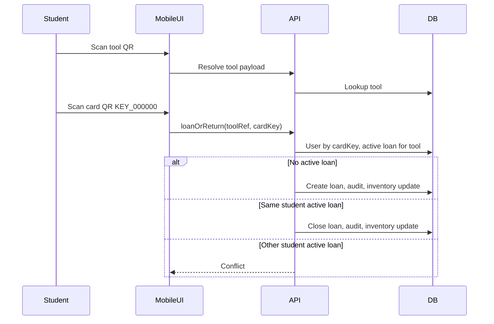

# Plan maestro: Kite Hub (laboratorio, préstamos por QR)

## Stack fijado (implementación)

| Capa | Elección |
|------|-----------|
| Framework | **Next.js** (App Router), TypeScript, Tailwind v4 + shadcn/ui según [design-system.mdc](.cursor/rules/design-system.mdc) |
| Autenticación | **Auth0** (`@auth0/nextjs-auth0` para App Router): sesión para **staff/admin**; estudiantes en flujo quiosco sin login Auth0 (ver Identidad) |
| Base de datos | **Microsoft SQL Server 2022** (motor y tipos T-SQL; entornos dev/staging/prod alineados en versión mayor) |
| Acceso a datos | **Drizzle ORM** con driver SQL Server (`drizzle-orm` + paquete compatible MSSQL) *o* **Prisma** con `provider = "sqlserver"` — elegir uno y mantener migraciones versionadas |
| Jobs / colas | Proceso Node separado, **Vercel Cron** / scheduler del host, o worker con cola (p. ej. BullMQ + Redis) según hosting |
| Email | Resend, SendGrid o SMTP; outbox en MSSQL |
| Ubicación del proyecto | Crear la app **directamente en** `c:\\Users\\JoseSantiagoMerinoHe\\Desktop\\Kite-Hub-Projecct\\` (**sin** carpeta contenedora adicional). |

**Referencia de dominio:** el directorio [kite-lab-idea](kite-lab-idea/) aporta ideas de esquema (`users`, `tools`, `inventory`, `loans`, `sanctions`, `auditLog`, `alerts`, `loanRules`) y flujos; el código allí (Vite, Express, tRPC, MySQL) **no** es el stack objetivo — portar conceptos y pantallas a Next.js + MSSQL.

---

## Contexto y punto de partida

El producto anterior en kite-lab-idea tenía desalineación documentación/código (p. ej. préstamo en UI sin cablear, alertas con consultas incorrectas). Este plan asume **implementación nueva** en Next.js con:

- **Route Handlers** (`app/api/...`) y/o **Server Actions** para mutaciones.
- **Middleware** de Next.js para proteger rutas del panel admin según sesión Auth0 y rol.
- Sin tRPC obligatorio; si se desea tRPC, puede convivir en Next como capa opcional, pero el plan no lo exige.

---

## Visión de producto

| Actor | Dispositivo / enfoque | Objetivo |
|--------|------------------------|----------|
| Estudiante | **Mobile first** (cámara, touch, lectores en estante) | Prestar o devolver con **mínima fricción**: escanear **herramienta** y **carné** (payload `KEY_000000`). |
| Encargado / admin | **Desktop first** | Inventario, préstamos globales, estudiantes, sanciones/bloqueos, métricas, bitácoras, alertas. |

### Flujo estudiante (doble QR)

1. **Escanear QR de la herramienta** → el payload debe resolver inequívocamente una herramienta (recomendación: usar el mismo `toolId` que en BD, p. ej. `MAR_001`, o un URL con host fijo que el cliente parsea; evitar solo URLs opacas sin validación).
2. **Escanear QR del carné** → validar formato `KEY_` + 6 dígitos (normalizar mayúsculas).
3. **Servidor**:
   - Resolver estudiante por `users.studentId` / `cardKey` según modelo.
   - Si no existe: política de **provisión** o error claro (“carné no registrado”).
   - Determinar **prestar vs devolver**: si hay préstamo **activo** de esa herramienta:
     - Si el activo es del **mismo** estudiante → flujo **devolución** (condición, notas).
     - Si es de **otro** estudiante → error de negocio (herramienta ya prestada a X).
   - Si no hay activo → **préstamo** (reglas de plazo por defecto, p. ej. 7 días; comprobar sanciones/bans).
4. **Feedback** inmediato y escritura en **bitácora**.

### Flujo administrativo

- **Tablero**: préstamos activos, vencidos, próximos a vencer, herramientas en mal estado / perdidas.
- **Estudiantes**: perfil, historial de préstamos, sanciones, **ban** vs **no permitir préstamos** temporal.
- **Herramientas / inventario**: alta, categorías, ubicación, vínculo al valor del QR.
- **Bitácoras**: global; filtros por alumno, herramienta, categoría, fechas; export CSV (PDF opcional después).
- **Métricas**: préstamos en el tiempo, devolución a tiempo, atrasos, incidentes, herramientas más solicitadas.

---

## Identidad y Auth0

### Staff y administradores

- Tras login Auth0, **sincronizar** usuario en tabla local `users` (clave estable: `auth0|sub` o email + sub en columna única).
- **Roles de aplicación**: mapear desde **Auth0 Authorization Extension / RBAC** (`roles` en el token) o `app_metadata.role` hacia `student` | `staff` | `admin` en BD en cada login (o solo `staff`/`admin` en Auth0; estudiantes del quiosco no pasan por Auth0).
- Rutas bajo `app/(admin)/...` o similar: `withPageAuthRequired` / middleware que exige sesión y rol.

### Estudiantes en el estante (“solo dos QR”)

El flujo de quiosco **no** usa sesión Auth0 del estudiante. Opciones coherentes con Next:

1. **Estación con API protegida por secreto** — `POST /api/kiosk/loan-or-return` con cabecera `X-Kiosk-Key` (rotación en vault) + **rate limiting** por IP; body `{ toolPayload, cardKey }`. Sin Auth0 en el cliente móvil del estante.
2. **Auth0 M2M (client credentials)** — máquina del quiosco obtiene token de servicio y llama API; más complejo en dispositivo compartido.
3. **Híbrido** — primer escaneo de carné crea cookie HTTP-only firmada (no Auth0) con `userId` de corta duración; siguientes ops solo herramienta.

**Recomendación:** **1 o 3** para simplicidad operativa en laboratorio.

**Formato carné:** validación Zod `^KEY_\d{6}$`, índice único en MSSQL, normalización a mayúsculas.

---

## Roles y permisos

- `student`: datos de perfil para bitácora; operaciones vía quiosco.
- `staff`: alertas, préstamos, sanciones operativas, bitácora.
- `admin`: CRUD completo, reglas, usuarios, configuración de correo.

Implementación: helper `requireRole(['staff','admin'])` en Server Actions / Route Handlers leyendo sesión Auth0 + fila `users` en MSSQL.

**Ban vs sanción:** flags/tablas como en el plan anterior; jobs que marquen préstamos > 7 días sin devolución según política institucional.

---

## Modelo de datos (MSSQL 2022)

Portar el modelo conceptual de kite-lab-idea a **T-SQL**:

- Tipos: `DATETIME2`, `NVARCHAR`, identidades `INT` o `BIGINT`, o **uniqueidentifier** si se prefiere PK global.
- **JSON** en `auditLog.details`: columna `NVARCHAR(MAX)` con JSON validado en app, o `JSON` tipo si se usa característica nativa 2022 según convención del equipo.
- Índices: único sobre `cardKey`; compuesto filtrado o sobre `(toolId, status)` para préstamo activo por herramienta.
- Transacciones **`BEGIN TRANSACTION`** en la capa de repositorio: préstamo/devolución + inventario + audit en un solo commit.

Tablas sugeridas (mismas entidades que el plan original): usuarios, herramientas, inventario, préstamos, sanciones, alertas, reglas, bitácora, outbox de email, notificaciones staff.

---

## Lógica de negocio en servidor (Next.js)

- Server Actions o Route Handlers llaman a servicios de dominio que usan el cliente MSSQL (pool singleton).
- **Idempotencia:** cabecera `Idempotency-Key` en rutas quiosco.
- **Jobs:** script `pnpm jobs:overdue` en CI/cron o `vercel.json` crons apuntando a ruta protegida por `CRON_SECRET`; el job consulta préstamos vencidos, escribe alertas, encola correos.

No hay dependencia del código legacy de `alerts.ts` en kite-lab; reimplementar consultas correctas (p. ej. “todos los préstamos activos”) en el nuevo proyecto.

---

## QR en el cliente (mobile first)

- `html5-qrcode`, `@zxing/browser` o `BarcodeDetector`.
- PWA opcional (`manifest`, service worker).

---

## Panel administrativo (desktop first)

- Layout App Router con sidebar/topbar alineado al design system (tokens `sidebar-*`, dominios blue/emerald/purple/violet).
- Tablas server-rendered con paginación vía searchParams o TanStack Table + fetch desde Server Components.

---

## Alertas: in-app + correo

- **In-app:** tabla `staff_notifications`; UI con polling o SSE desde Route Handler; alternativa **Ably/Pusher** si se requiere tiempo real sin mantener conexiones largas en serverless puro.
- **Correo:** outbox en MSSQL; worker o mismo cron que procesa filas `pending`.
- Destinatarios: usuarios con rol staff/admin y email (sincronizado desde Auth0 `email`).

---

## Seguridad

- Auth0: PKCE, callbacks solo en dominios permitidos; rotación de client secret en producción.
- Kiosk: clave rotada, rate limit, validación de tamaño de payload.
- Cookies de sesión Auth0 gestionadas por el SDK; no almacenar tokens en `localStorage` para staff.

---

## Observabilidad y calidad

- Logging estructurado; `requestId` en APIs.
- Tests: Vitest/Jest para dominio; integración con contenedor SQL Server o base dedicada de test; Playwright para flujo quiosco crítico.

---

## Despliegue

- **MSSQL 2022** gestionado (Azure SQL, AWS RDS SQL Server, o instancia institucional); cadena de conexión cifrada (`encrypt=true`).
- Next.js en Vercel, Azure App Service, o contenedor; jobs en el mismo proyecto (cron) o worker aparte si la carga lo exige.
- Migraciones: Drizzle Kit / Prisma Migrate contra SQL Server.

---

## Fases de entrega (orden recomendado)

1. **Bootstrap:** Next.js + Auth0 + MSSQL + esquema base + sync de usuario al login, creado **en la raíz del workspace**.
2. **Dominio:** préstamo/devolución transaccional + quiosco + formato `KEY_000000`.
3. **Cliente estudiante** mobile first.
4. **Jobs** de vencimiento + email + notificaciones in-app.
5. **Panel admin** completo.
6. **Métricas y bitácoras** avanzadas + export.
7. **Endurecimiento:** seguridad, tests, PWA, documentación.

---

## Riesgos y dependencias

- Alineación del contenido del **QR físico** con `toolId` o tabla de mapeo.
- **Alta masiva de estudiantes** (import CSV/API) para que `cardKey` resuelva en quiosco.
- **Hosting serverless + SQL Server:** cold start y límites de tiempo en jobs largos; valorar worker dedicado para correo y agregados.
